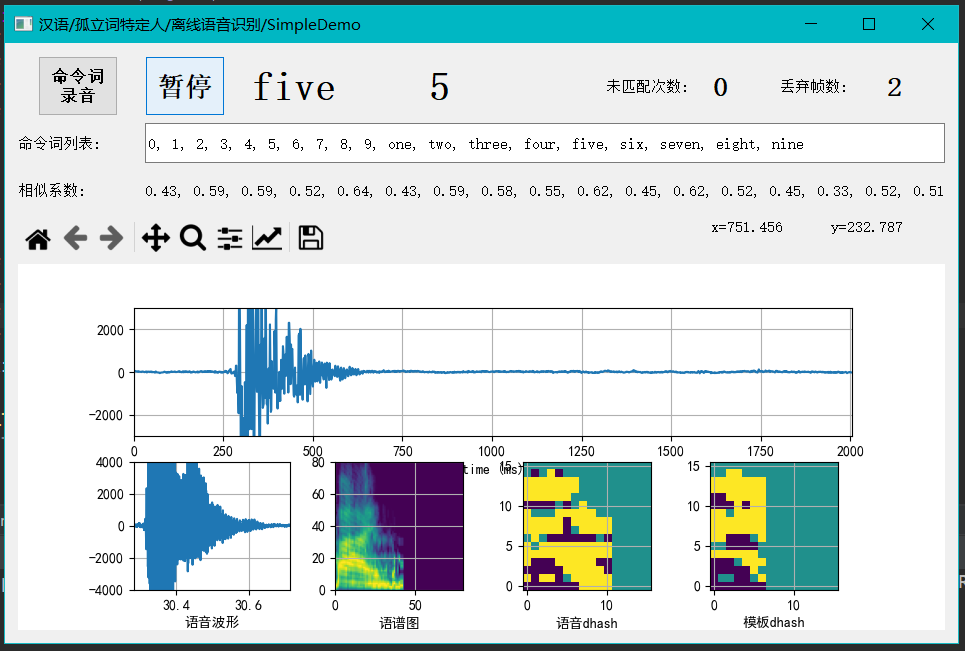

#### 一、功能说明  Simple ASR Description  
简单的离线命令词语音识别程序。
针对特定人，需要预先录制命令词语音模板。

**建议使用外接麦克录音，电脑内置麦克可能因为噪音过大不能正常识别语音**

本程序最多支持20个命令词，模板录音最长时间20秒。    
直接匹配语谱图特征（类似dhash），能够简单识别**中文**、**英文**及各种**方言口语**。
 

Simple offline command word speech recognition program.    
for specific people, need to pre-record the command word speech template.    

**It is recommended to use an external microphone for recording. 
The built-in microphone in the computer may not be able to 
recognize speech normally due to too much noise**    

The program supports a maximum of 20 command words, 
voice template recording a maximum of 20 seconds.        
By directly matching the language spectrum features (similar to Dhash), 
it can simply identify **Chinese**, **English** and **various dialects**.    

#### 二、开发环境 Development Environment
python  3.8.1        
numpy  1.18.2   
matplotlib  3.2.1        
pyaudio  0.2.11           
PyQt5  5.14.2      
wave    

#### 三、屏幕截图 Screenshot    

